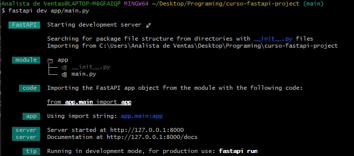
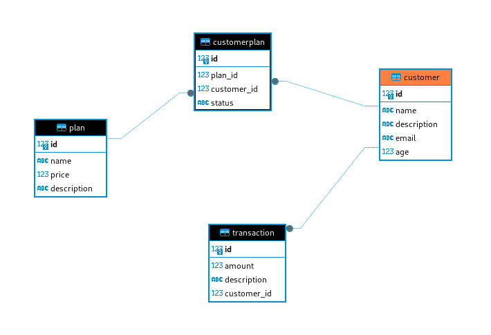
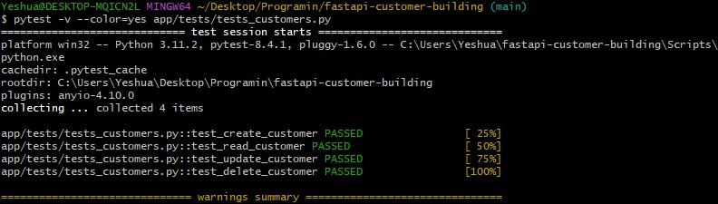

# FastAPI


## Instalación  
```
pip install -r requirements.txt
```
Ejecutar la aplicación en modo desarrollo.
```
fastapi dev
```


## 📂 Estructura del proyecto

```bash
.
├── app
│   ├── __init__.py
│   ├── main.py
│   ├── routers
│   │   ├── customers.py
│   │   ├── invoices.py
│   │   ├── plans.py
│   │   └── transactions.py
│   └── tests
│       ├── tests.py
│       └── tests_customers.py
├── db.py
├── models.py
├── create_multiple_transactions.py
├── requirements.txt
└── README.md
|
+---images
|       der.png
|       fastapi.png
|       report_tests.png
|       run_fastapi.png
|
\---__pycache__
        conftest.cpython-313-pytest-8.4.1.pyc
        db.cpython-313.pyc
        main.cpython-313.pyc
        models.cpython-313.pyc

## Diagrama de BD


## Midlewares
Permiten agregar funcionalidades a todos los requests y response de nuestra API


## Template de la comunidad 

La comunidad de FastAPI ha creado un template listo para su uso. Puedes encontrarlo en el siguiente [enlace](https://github.com/fastapi/full-stack-fastapi-template)
```
https://github.com/fastapi/full-stack-fastapi-template
```

## Reporte de pruebas unitarias
```
coverage run --source app/ -m pytest
coverage report
```

